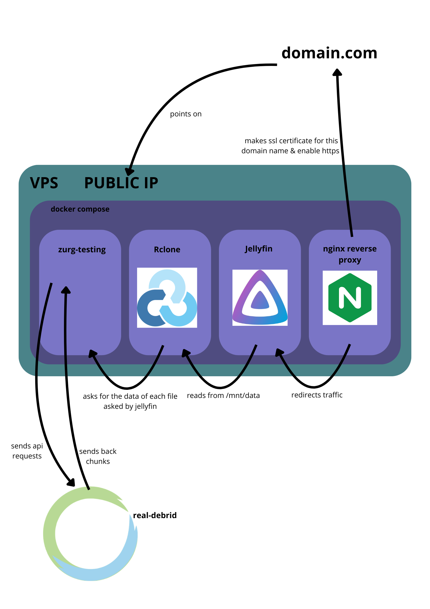

# Jellyfin + Zurg + Rclone + Real-Debrid Stack


This repository provides a ready-to-use Docker Compose stack to deploy a private, encrypted, and globally accessible media server using Real-Debrid and Jellyfin.


## Presentation


This infrastructure allows you to stream your Real-Debrid library directly without local storage. By using a VPS as a gateway, you benefit from a centralized media center (Jellyfin) protected by an SSL-encrypted reverse proxy (Nginx Proxy Manager).


## Architecture





The stack consists of these interconnected layers:

1. **Zurg**: Acts as a bridge between the Real-Debrid API and your server.

2. **Rclone**: Mounts the Zurg WebDAV server as a local filesystem in `/mnt/zurg`.

3. **Jellyfin**: The media server that indexes and streams the mounted files.

4. **Nginx Proxy Manager (NPM)**: Handles HTTPS, SSL certificates, and redirects traffic to Jellyfin.


## How to Use


### Prerequisites

* A VPS (Debian/Ubuntu recommended).

* Docker and Docker Compose installed.

* **FUSE** installed on the host: `sudo apt install fuse3`.

* A domain name pointing to your VPS IP address.


### Installation


1. **Clone the repository:**

```bash

git clone [https://github.com/Ouass77ck/jellyfin-rclone-zurg-rd.git](https://github.com/Ouass77ck/jellyfin-rclone-zurg-rd.git)

cd jellyfin-rclone-zurg-rd

```


2. **Configure Zurg:**

Open `config.yml` and replace `yourapikey` with your actual Real-Debrid API Token.


3. **Create the mount point:**

```bash

sudo mkdir -p /mnt/zurg

sudo chown $USER:$USER /mnt/zurg

```


4. **Launch the stack:**

```bash

docker-compose up -d

```


### Access & Security


1. Access **Nginx Proxy Manager** at `http://YOUR_VPS_IP:81`.

2. Add a **Proxy Host**:

* **Domain Names**: `your-domain.duckdns.org`

* **Scheme**: `http`

* **Forward Name/IP**: `jellyfin`

* **Forward Port**: `8096`

3. In the **SSL** tab, request a new Let's Encrypt certificate and enable **Force SSL**.

4. **Launch the stack sequentially:**
To prevent Jellyfin from scanning an empty folder before the mount is ready, you must start the data sources first:
```bash
docker-compose up -d zurg rclone
# Wait 10-15 seconds for the FUSE mount to establish, you can verify with 'ls /mnt/zurg'
docker-compose up -d jellyfin npm


## Troubleshooting


If things aren't working, check the logs of the specific service:

```bash

docker logs zurg

docker logs rclone

docker logs jellyfin

```


**Fixing a frozen mount (Stale File Handle / Input-Output Error):**
If Jellyfin loses access to the files but the containers are still running, the FUSE mount has likely crashed. Do not restart Jellyfin directly. Instead, force unmount the directory:
```bash
docker-compose down
sudo umount -l /mnt/zurg
docker-compose up -d zurg rclone
# Wait 15s, then start Jellyfin
docker-compose up -d jellyfin npm**Fixing a frozen mount (Stale File Handle / Input-Output Error):**
If Jellyfin loses access to the files but the containers are still running, the FUSE mount has likely crashed. Do not restart Jellyfin directly. Instead, force unmount the directory:
```bash
docker-compose down
sudo umount -l /mnt/zurg
docker-compose up -d zurg rclone
# Wait 15s, then start Jellyfin
docker-compose up -d jellyfin npm
```
## Possible questions


#### Why use a VPS instead of streaming directly from Real-Debrid?

Real-Debrid allows multiple simultaneous connections only if they originate from the same public IP address.


The Risk: If you share your account or use it on multiple devices with different IPs (e.g., your home Wi-Fi and your phone's 4G), you will be banned.


The Solution: The VPS acts as a single "entrypoint". To Real-Debrid, it looks like only one device (your server) is downloading, regardless of how many users are watching via Jellyfin.


#### Can I use a Cloudflare Tunnel instead of Nginx Proxy Manager?

Yes, but it is not recommended for video streaming.

Cloudflare's Terms of Service (Section 2.8) strictly prohibit using their standard proxy/tunnel for high-bandwidth video streaming on free plans. Doing so can result in your domain or account being flagged and suspended. Nginx Proxy Manager on a VPS gives you full control without these restrictions.


#### What if I don't want to use a VPS?

You can deploy this stack on a local machine (Home Server/NAS).


Local Network: It will work perfectly within your home.


Remote Access: You can use Port Forwarding on your router to expose the ports, but generating SSL certificates for HTTPS can be complex without a domain.


Better Alternative: For private remote access without a VPS, consider using Tailscale or Wireguard to create a secure virtual network between your devices and your local server.

#### Why is my Jellyfin library scan frozen (e.g., stuck at 92%)?
If Real-Debrid receives a DMCA takedown for a specific file, it gets flagged as an `infringing_file`. Zurg will fail to unrestrict it, but the file name remains in the virtual drive. Jellyfin's `ffprobe` will freeze indefinitely trying to read this dead link.
**Solution:** Check `docker logs zurg` for `infringing_file` errors. Identify the blocked torrent, delete it from your Real-Debrid cloud, clear the cache with a restart, and rescan the library.

## Authors


Ouass77ck 

